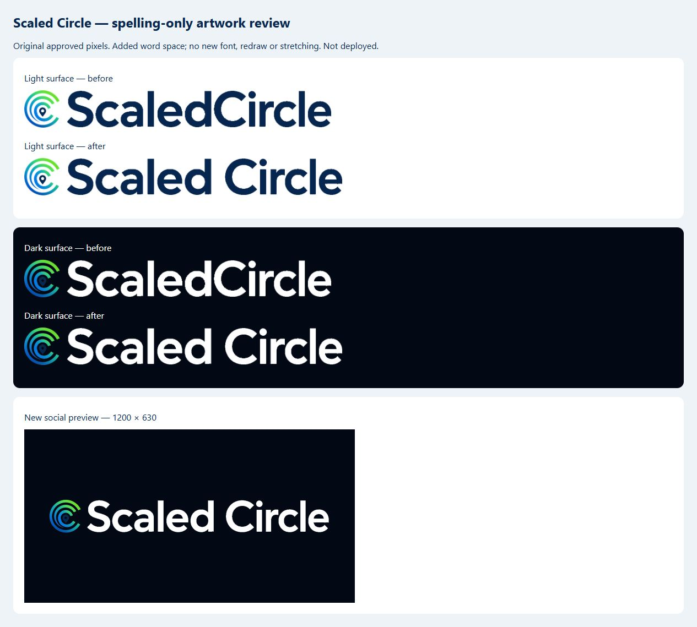

# Scaled Circle completed brand package — review only

Prepared on September 28, 2026. **Not deployed.** The commit containing this document is the final review source. It completes spelling candidate `dcaf3e2f0d6fcf823c11a3f00b95661bcab5e8a1`; it does not claim installed apps, historical content or external consoles have changed.

## Preserved production baseline

The isolated `codex/brand-spelling-review` branch incorporates the separately deployed own-team baseline through merge `f7a952f747a856e19159f0a9a356dcf888838565` (parent `cd5c294`, deployed application source `16dabbf907baf54487ade9c453db278e4c38fa21`). Own-team is already live, not unfinished work silently shipped with branding. Its implementation remains independently identifiable and unmodified by this completion.

The live Hosting baseline was read back as `sites/scaled-circle/versions/414aeb5e1f4ea9a9`. Its main bundle and five maintained static pages matched the retained deployment manifest. Profile-banner/21061 repair `c2f8c9f`, campaign management, mapping/freehand and other current web repairs are retained. `businessoperationsv1-00014-ruk` is the existing own-team revision, not a branding deployment.

The frozen native checkout remains `0f57f0894a06fc0de0b769d3c4fa012c62e51cb1`; no native merge/build, store upload, build-number use, account change or deployment occurred.

## Exact artwork correction

Source: `apps/mobile/assets/brand/source/scaledcircle-approved-artwork.png`, 1254 × 1254, SHA-256 `7fe471f94a00bd5595b9c48ea5ede2ebf52004fc94b6c31ef65a279735d874fb`.

The maintained extraction script already has the approved symbol and word crops. The source separates Scaled and Circle by 47 pixels; the old compact lockup reduced this to 4 pixels. `docs/generate_web_brand_assets.ps1 -SpacedWordmarkOnly` restores the original 47-pixel gap. There is no font substitution, AI-generated identity, screenshot crop, re-lettering, squeeze or stretch. Every symbol/letter pixel is preserved; Circle is translated 43 pixels to the right. A vector/font master was not supplied, but is unnecessary for this exact mechanical correction from the high-quality approved source.

| Asset | Prepared result |
| --- | --- |
| Light lockup | `apps/mobile/assets/brand/wordmark-20260928/scaledcircle-lockup-light-surface.png`, 1232 × 145, transparent |
| Dark lockup | `apps/mobile/assets/brand/wordmark-20260928/scaledcircle-lockup-dark-surface.png`, 1232 × 145, transparent |
| Social preview | `apps/mobile/web/social/scaled-circle-social-preview-20260928.png`, 1200 × 630 |

The original compact lockups are 1189 × 145. Social artwork keeps the original background, symbol, proportions, scale and centered alignment; the wordmark is allowed to grow naturally in width. Existing symbol-only icons and secondary marketing lockup are unchanged. No trademark or legal claim was added.

New asset URLs are versioned. Old lockup/social files remain byte-for-byte intact, including in the prepared Hosting output, so an already-approved creative cannot change because its shared image URL was overwritten.

## Rendered surface review

These are local review proofs, not App Store screenshots or live rebrand acceptance.

| Surface | Evidence |
| --- | --- |
| Public desktop header and Business page | [Desktop](qa-artifacts/brand-20260928/public-desktop.png); actual prepared HTML and versioned light wordmark |
| Public narrow header/footer | [390-pixel header](qa-artifacts/brand-20260928/public-narrow.png), [footer](qa-artifacts/brand-20260928/footer-narrow.png); no horizontal clipping observed |
| Login/signup | [Login](qa-artifacts/brand-20260928/login-narrow.png), [signup](qa-artifacts/brand-20260928/signup-narrow.png); actual local production-config Flutter web build, logged out |
| Business/Scaler navigation | [Business narrow](qa-artifacts/brand-20260928/business-navigation-390.png), [Scaler desktop](qa-artifacts/brand-20260928/scaler-navigation-1100.png); maintained header/menu rendered in widget harness with synthetic identity, not production authentication |
| Future email | [Narrow welcome email](qa-artifacts/brand-20260928/email-narrow.png); actual template with synthetic fixture, no send |
| Social sharing | Versioned 1200 × 630 image above; OG/Twitter metadata references it |
| Future marketing materials / map records | Prepared authored labels, HTML/PDF metadata and renderer tests; old immutable versions/exports untouched, no production generation/model call |
| Prepared store materials | Existing reviewed descriptions/reviewer documentation updated in the text candidate; console listings unchanged |

Navigation fixture screenshots use Flutter's local Roboto font for readable test text; they do not represent real accounts or customer records. Header/menu brand assets are the actual maintained components. Narrow/2× text behavior is also covered by existing focused widget tests. No physical-device branding acceptance is claimed.

## Queue and immutable-version disposition

Read-only inventory at **2026-09-28 12:06:57 UTC (08:06:57 Eastern)**. No queue was paused, edited, sent, retried, regenerated, rescheduled or reapproved.

| Queue inspected | Relevant active records |
| --- | ---: |
| `outboundEmailJobs` queued/retry/sending/held states | 0 |
| `artifactDeliveryEmailJobs` queued/sending/retry states | 0 |
| `notifications.push` queued/digest/retry/sending/unknown/provider-attention states | 0 |
| Legacy `socialPublishingJobs` active/review states | 0 |
| Canonical `socialGrowthJobs` | **12: 6 scheduled, 2 approved, 4 authority_review_required** |

All 12 canonical Social jobs have version/content/binding hashes. Projected binding metadata contains neither the old shared wordmark/social URL nor literal joined brand text. The inspection did not re-render or certify every existing artwork pixel. Existing referenced media/version IDs and historical image URLs remain intact, which preserves approval even when an image contains historical spelling. Four authority-review cases already existed; branding neither resolves nor resets those cases. No item requires renewed approval solely to preserve this spelling update. Replacing any approved old creative later would require its normal new-version/approval flow.

Sanitized job identity/status evidence: [queue-disposition.json](qa-artifacts/brand-20260928/queue-disposition.json). No message body, recipient, credential, token or private creative is included.

| Delivery-time path | Compatibility rule |
| --- | --- |
| Payload-rendered landing-page emails | New producer pins `templateRevision: brand-20260928`; absent/unknown revision renders original ScaledCircle authored chrome. Customer text is never substituted. |
| Stored email payloads | Approved subject, text and trusted HTML remain exact; sender uses saved approved name/legacy fallback. |
| Artifact email | Stored approved body and sender preserved despite new global display name. |
| Weather delivery recheck | Eligibility recheck remains intact; authored copy uses the job's pinned template revision. Existing unversioned job stays old. |
| Mobile push | First enqueue pins `MobilePushCopyV2`; existing queued/retry state is not rewritten. Digest grouping includes template revision. Minimal payload, recipient authority and deep links unchanged. |
| Customer landing pages | New immutable version pins `brandRevision`; existing immutable versions retain original platform footer. No customer page is silently republished. |
| Social/approved creative/history | Existing immutable bindings and original asset URLs preserved; only future reviewed versions use new spelling. |

Before any later approved promotion, refresh the narrow queue inventory because scheduled work can change naturally. Deploy compatibility-aware consumers before new-version producers where they are separate functions. Never bulk rewrite queued records or deploy every mirrored Functions directory.

## Validation

**196 distinct focused tests passed:** 120 Node, 59 Flutter, 10 Python public-page/delivery, 7 Python spelling/preservation invariants. Node includes 9 brand-version/pixel tests. Flutter includes four real header/menu component checks at 390/1100 widths for Business and Scaler. The three maintained transactional-email module copies also passed a direct old/new rendering smoke check after retaining each copy's own source baseline.

Affected analyzer: clean. Production-config Flutter web build: passed, 62.4 seconds; offline lock-enforced dependency resolution passed. Build-input verification checked **322 source files, zero missing/mismatched inputs**. Dependency lock unchanged. `git diff --check` passed. This was a local web build, no native/CI run.

Test coverage includes immutable payload preservation, future-version selection, old/new push data equivalence, weather rendering, artifact sender retention, legacy landing-page footer, exact wordmark pixels, social dimensions, unchanged historical assets/native files/URLs/identifiers/prices, existing profile/own-team/planner regressions and public narrow/large-text layouts.

## Narrow future deployment scope

Prepared Hosting package: `.firebase/brand-completion/public`. Prepared main JS SHA-256: `5b2ab3924e7a912c7a7a4d1f3ce3a269df67e8fb3a799db2f089d937d3eed11c`. [Package manifest](qa-artifacts/brand-20260928/package-manifest.json) records the live baseline and five static-page before/after hashes.

After artwork/package approval only: Hosting plus affected maintained branding/template consumers and future template producers. Apply the bounded changes to the then-current, generation-pinned deployed server sources. A full snapshot redeploy of Functions directories is not part of this package; neighboring codebase copies intentionally retain their own nonbranding code. Recheck current Hosting/server baseline before promotion to preserve intervening repairs.

No Rules/IAM/secrets/configuration migration, price/entitlement/financial change, provider setting, account rename, subscription change or native build belongs in this deployment.

## Intentional retained spelling and pending work

Keep technical identities: `scaledcircle.com`, email addresses, social handles, Firebase project, `com.scaledcircle.app`, API/schema fields, class/import/file names, repository names, QR destinations, analytics/privacy keys, OAuth/signing identifiers and provider User-Agent strings. Keep sent/published/approved/history records unchanged. Keep **Scaled Circle LLC** where the legal entity belongs.

Native: shared Dart strings, versioned asset references/pubspec delta and `docs/brand-native-display-name-20260928.patch` are retained here for later reviewed reconciliation. The native platform patch remains unapplied. Frozen native source and installed builds are unchanged.

External, separate approval/work: App Store/Play public display title and metadata; Google OAuth consent display name; applicable provider sender/product/portal display names. No account/ID/handle rename, verification restart, OAuth reconnect or external console edit was performed. Existing store/TestFlight names are not automatically renamed.

The package is ready for artwork and deployment-scope review. **The brand update is not live or complete everywhere.**
