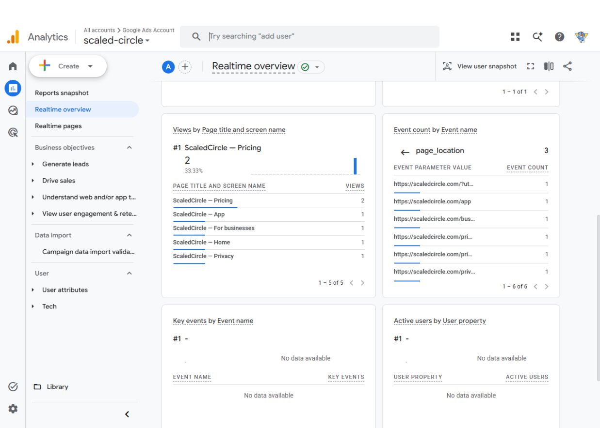

# GA4 production deployment — September 27, 2026

## Result

Hosting-only deployment is live at https://scaledcircle.com. Actual browser visits
were received by GA4 Realtime in the intended property. No account-access blocker
remains for this release.

- Integration fetched from `ATRcodingbot/ScaledCircle`, including PRs #1 and #2,
  through merge `7fdc639e5db52e97ad7ac50fea6c441cc4ebdeb2`.
- Integrated application source: `e5ce7ed7880c740d11f935726ebf92c020adac54`.
- Deployment/package source: `cf25f484ee9b10ab1854f0fb67dbbf4d876cfb3f`.
- Hosting version: `sites/scaled-circle/versions/f70910ac1cd42499`.
- Release time: `2026-09-27T16:04:33.337Z` (12:04:33 PM Eastern).
- Served main bundle SHA-256:
  `f1f43bfc83ce32c1889d8489aeded4f467aea8f3b9a95ad8db131812e43d8268`.

The primary checkout remains clean at frozen native source
`0f57f0894a06fc0de0b769d3c4fa012c62e51cb1`. Integration used the existing isolated
`codex/maryland-web-operations` worktree, preserving the newer deployed mapping,
CRM, public-page and other web repairs. No old GitHub snapshot replaced production.
No native build, Functions deployment, financial change or data migration occurred.

## Analytics destination and settings

Verified through the signed-in Google Analytics UI:

| Setting | Result |
| --- | --- |
| Account | Google Ads Account, `335270603` |
| Property | `scaled-circle`, `548368356` |
| Existing web stream | `flutter_app (web)`, `15375618489` |
| Measurement ID | `G-9VY50190LG`, matching production Firebase **web** configuration |
| Website URL | Previously blank; saved as `https://scaledcircle.com` |
| Enhanced Measurement | Already disabled; retained off before release |
| Google signals | Off; UI offers “Turn on Google signals” |
| Ads personalization | Changed from allowed in 307 regions to **0 of 307**; saved result verified |

No different stream, native analytics SDK or Windows measurement ID was activated.
The integration additionally denies ad storage, ad user data and ad personalization
and sets both Google-signals and ad-personalization flags false.

## Package and validation

- Nine Node analytics tests passed, including routing, query/referrer sanitation,
  opt-outs, Global Privacy Control/Do Not Track precedence, cross-tab changes,
  settings-page isolation, storage failures and staging/origin isolation.
- Six affected Flutter legal-page tests passed; affected analyzer clean.
- JavaScript syntax and whitespace checks passed.
- `flutter build web --release --dart-define=APP_ENV=production --no-pub` passed
  in 36.9 seconds. All 319 declared compiled application inputs matched the source.
- Dependency lock unchanged. Hosting headers and rewrites unchanged.
- The five retained public HTML pages received only the same analytics script
  loader. Removing that insertion reproduces their previous bytes exactly.
- Public trailing-slash routes are normalized to their named public page, with a
  focused regression test. Private/dynamic paths remain `/app`.
- Served index, main bundle, bootstrap, service worker, all three analytics assets
  and five retained public pages returned HTTP 200 with matching package hashes.

Private manifests and deployment readback:
`.firebase/ga4-hosting-20260927/manifest.private.json` and
`.firebase/ga4-hosting-20260927/deployment.safe.json` (ignored).
Reproducible package preparation: `tools/prepare_ga4_hosting.py`.

## Live browser and GA4 receipt

The browser DOM showed the intended Google tag URL with `id=G-9VY50190LG`.
There was no analytics prompt, overlay or floating button on the inspected public
pages. Privacy Policy disclosed analytics cookies and linked to the working
Website privacy settings page. That page contained no Google tag, including
after enabling measurement.

GA4 Realtime showed one active user and the following received page locations
during the bounded verification sequence (one view per listed location at the
captured checkpoint):

- `https://scaledcircle.com/?utm_source=deployment_check&utm_medium=qa&utm_campaign=ga4_20260927`
- `https://scaledcircle.com/businesses?utm_source=deployment_check&utm_medium=qa&utm_campaign=ga4_20260927`
- `https://scaledcircle.com/privacy`
- `https://scaledcircle.com/pricing?utm_source=deployment_check&utm_medium=qa`
- `https://scaledcircle.com/app`
- `https://scaledcircle.com/pricing`

The synthetic private query marker was absent from the received Pricing URL.
The nonexistent synthetic campaign path became `/app`, without its ID or query.
No campaign was created or edited. Standard first-visit, session-start and
engagement events were also visible. Country reporting showed United States.
The initial existing browser session at `/` displayed a session-verification
error; no session data was cleared or authentication repair attempted. Public
Businesses, Pricing and Privacy pages were then verified normally.

Opt-out was tested through the actual settings button: the UI reported “off”,
that setting survived reload, and a fresh public-page load had zero Google-tag
script elements. The settings page also had zero Google tags. The prior enabled
behavior was restored through its button after the check, and test tabs closed.
Browser privacy-signal coverage is automated test evidence; it is not claimed as
a separately changed physical browser privacy setting.

Receipt evidence is the actual GA4 Realtime parameter table, not a synthetic
Measurement Protocol send. No browser credential extraction was used.

[Live public presentation](qa-artifacts/ga4-live-public-no-prompt-20260927.png) ·
[Saved opt-out](qa-artifacts/ga4-live-opt-out-20260927.png)

## Owner report navigation

[Open ScaledCircle Analytics](https://analytics.google.com/analytics/web/#/a335270603p548368356/realtime/overview).
The existing property navigation was inspected:

- Current visitors: Reports → Realtime overview.
- Visitor trends: Home, selecting the desired date range.
- Referral/traffic sources: Reports → Generate leads → Traffic acquisition.
- Pages: Reports → Understand web and/or app traffic → Pages and screens.
- Approximate locations: Reports → User → User attributes → Demographic details;
  use Country, Region or City as available. These are approximate, not precise
  visitor locations.

Normal aggregate reports may lag Realtime. This deployment does not backfill
visits before installation. Website privacy controls remain available at
https://scaledcircle.com/analytics-settings.html.
