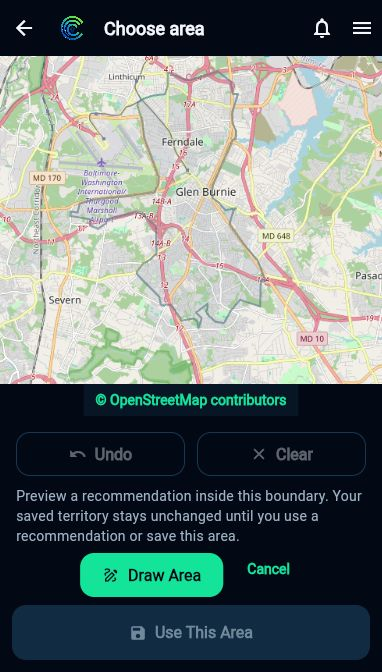

# Manual mapping and own-team planning — production promotion

September 30, 2026. Deployment complete; the single new physical manual-boundary
analysis remains pending. This report does not close either original unsaved
outline failure, whose exact coordinates were not retained.

## Source and deployment

Reviewed application: `7c32bdad879ba379e19d6ea16cb9ff36076e3d20`.
Production-overlay/package tooling: `119351a1cc4449482d6686879f82ab73a58b8ed6`.
The latter adds deployment verification/tools only; the application delta is unchanged.

| Endpoint | Active revision |
| --- | --- |
| getCampaignZoneIntelligence | getcampaignzoneintelligence-00002-nob |
| confirmCampaignZoneIntelligence | confirmcampaignzoneintelligence-00002-taq |
| getSmartZonePlan | getsmartzoneplan-00013-vix |
| applySmartZonePlan | applysmartzoneplan-00013-juc |
| businessOperationsV1 | businessoperationsv1-00015-tar |

All five deployments preserved configuration and IAM. Generation-pinned deployed
source archives match their prepared inventories, including preserved environment
and dependency-lock bytes. No financial, assignment, completion, Rules, IAM,
Email/Social/research or profile endpoint was deployed.

Hosting: **1013b9e77d88b14d**, released **2026-09-30T14:50:18.105Z**.
Previous release: **4c0f96fddb2306d7**.
Only `main.dart.js` and `flutter_bootstrap.js` changed; 78 other retained package
files and Hosting configuration/rewrites remain unchanged. Compilation input
verification checked 326 source files. Served main/bootstrap/index/Business/Pricing
files match the prepared package. Branding, analytics, direct registration,
onboarding/profile, own-team attribution and earlier mapping repairs are retained.

## Existing profile assertion

The broader generated-package assertion remains separately failed:
`functions-business-profile/index.js` omits `profileCompletion`.
Actual live `getBusinessWorkspaceContext` is a different maintained workspace
package, contains the authoritative profile-completion call, and its complete
endpoint AST matches the maintained declaration. Its existing revision
`getbusinessworkspacecontext-00005-wax` was not changed.

None of the five promoted overlays imports the failing generated profile package.
The test was neither weakened nor reported passing. Seven additional promotion
checks passed, covering actual package inventories, unchanged unrelated endpoint
ASTs/configuration/locks, dependency closure, bindings, profile exclusion and
old/new cache-reader compatibility. The accepted focused implementation evidence
remains 302 distinct checks (147 Node, 49 emulator, 95 Flutter, 8 Python and 3
transitive/generator), clean affected analyzer and a production-config web build.
This is not a claim that the broader suite is all green.

## Bounded cache publication

Published pointer generation: **1790779749192125** at **2026-09-30T14:49:09.207Z**.
Manifest SHA-256:
`c502f573882ec4ad0cbd4fb936b1f572fe64ee00b7b856f11c07d9f80e3a26b1`.
Source PBF SHA-256:
`fca54b6b3d2cf6632e79a6a93413d77c0019743ff1bbef52e93188a28d79fc20`.

- Provider: Geofabrik Maryland / OpenStreetMap.
- Source snapshot: 2026-09-25T20:24:36Z.
- Retrieval: 2026-09-26T21:55:03.501020+00:00.
- Import: 2026-09-30T13:35:06.465Z. Import is not a newer source date.
- Bounds: `[-76.6945750000126, 39.108224999811924, -76.58875599983642, 39.21576000007699]`.
- Schema/parser: SmartZonePublicCacheV1 / SmartZoneOsmGeometryV2;
  inventory OsmPublicObjectsV2.
- 16 immutable tiles, 4,291,225 compressed bytes; all 16 readback hashes passed.
- 58,419 tile copies / 57,333 unique objects, including 12,363 roads,
  42,930 buildings, 39,300 generic buildings and 87 relations.
- Required members retained; maximum raw tile 5,520,388 bytes.
- Within the existing 8 MiB operator import cap and reader limits.

This is buffered 21061 pilot coverage, not complete statewide coverage or
classified residential coverage. Generic buildings remain unclassified.
Every prior object ID and the full previous coverage were retained. Objects were
staged and validated before the generation-guarded manifest switch.
Previous known-good pointer: **1790466480055656**. Its manifest and objects remain
available; rollback uses a compare-and-swap of the current pointer to those
retained manifest bytes, not deletion or rewriting of immutable objects.
No recurring refresh job, paid provider or new resource was created.

## Live browser evidence and remaining acceptance

Authorized workspace: Attractive Remodel. Existing unpaid own-team draft:
`plan_ea02715e0a76d5e4bf362353428f6e130aca5d6d61a130e37b348d3adae47fc0`.

The served client opens the manual editor at the selected 21061 location with a
blank goal, no saved Zone, no marketer count and no selected coverage pattern.
No workload is saved merely by opening it. Persistent Draw Area/Cancel controls
are visible at the map; acceptance is disabled for the empty boundary. Cancel
and reopening returned the unchanged blank draft context.

The browser tool selected the existing Rectangle control, but two map clicks
produced **zero observable verification points and no preview**. Those actions
do not establish drawing, analysis or physical acceptance. The attempt was
cancelled; the normal manual editor is now ready. Founder was asked only to draw
one new unsaved Ferndale boundary and leave the analysis preview open—no Use,
Save, recommendation or funding action. No new live request/digest/counts can
be reported until that boundary actually reaches analysis.

| Outcome | Current evidence |
| --- | --- |
| A. Manual navigation/drawing | Live entry at selected ZIP passes; new physical drawing pending |
| B. Cache acquisition/projection | Publication/readback and focused replay pass; new live boundary projection pending |
| C. Classification/full workload | Limited by available public classification; unclassified buildings/walking alone do not close this requirement |
| D. Own-team capacity | Focused server/widget tests pass; live legacy draft requires input review, no invented headcount/pattern |

Team capacity requires explicit per-person duration, integer headcount and split
versus together. Split 4-hour sessions with 1/2/3/4 marketers target 4/8/12/16
coverage-equivalent person-hours; together targets 4 hours of unique coverage.
These are synthetic test cases, not this draft's operational instructions.
The retained local 5-hour, 2-person split example supports 189 of 600 requested
minutes (411-minute shortfall), not a new production request. Marketplace
`ceil(hours / 6)` is unchanged. Travel/elapsed time and unsupported workload
remain unknown; geometry/account/team stale-response tests remain automated
evidence until an observable new boundary is inspected.

## Saved-state and authority preservation

Before deployment, after deployment and after tool entry/Cancel/reopen, the
campaign field hash remains
`1a7f34b32a9ba78cd6764a15f5be33200a2d17f96bbb00dcc8d39a69d1439ec2`.
Zero saved Zones, campaign payment records, assignment compensation records and
completion records remain unchanged. This draft has no original saved Zone to
restore; do not describe it as a new proof of the earlier separate two-Zone
physical restoration PASS.

No person, seat, assignment, work, financial transaction or real profile save was
created for QA. Frozen native checkout remains clean at
`d60920930c81253f9019c19bed47a3eaf184dd3e`; no native CI/build/upload occurred.
Payout guidance and Admin first-use visibility remain separate scopes.
