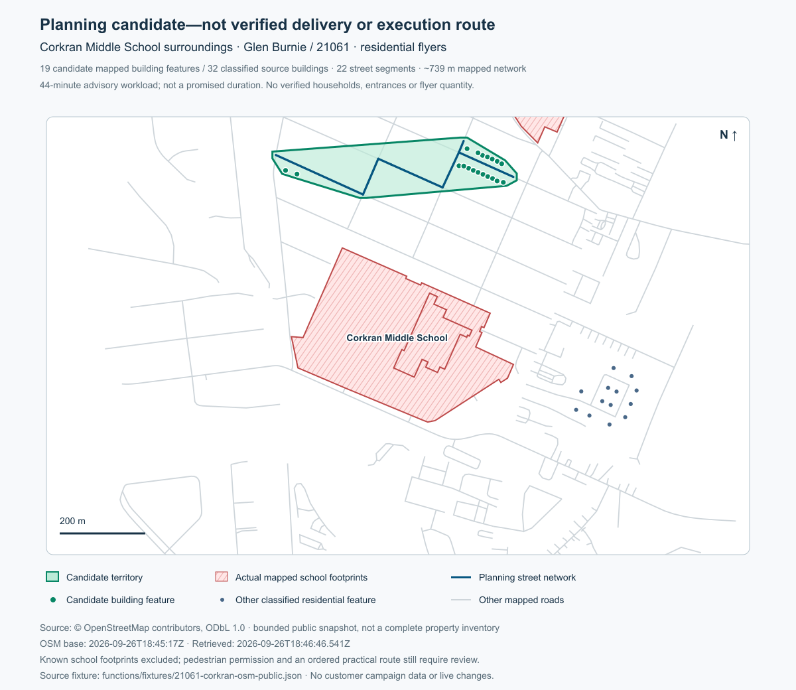

# Mapping QA — predeployment review, September 26, 2026

This is an isolated web/server candidate. Nothing in this QA batch has been deployed. Native release source `0f57f0894a06fc0de0b769d3c4fa012c62e51cb1`, iOS38/Android37, store selections, financial controls and Business operations remain unchanged. The existing unsaved production map and test draft were preserved; no recommendation was applied or fake campaign created.

## 1–4. Manual interaction and safety

**Draw Your Area** is the primary manual workflow alongside **Recommend an Area**. Browse Map → Draw Area → mouse-primary-button/finger trace → release/lift → closed preview → Use This Area / Edit Boundary / Undo / Clear. Entering Draw mode scrolls the canvas into view; a sticky Cancel drawing control stays reachable. The map returns to normal pan/zoom after the stroke. Adjust Area opens the exact recommended boundary in this same editor and location. Editing supports deliberate redraw with Undo; it does not claim per-vertex drag handles.

Drawing is restricted to explicit Draw mode. Pointer cancellation, a second touch, leaving the map or exceeding the sample limit cannot silently save a truncated area. A failed trace preserves the prior boundary. Saving still requires the existing explicit action and campaign authority. Intermediate trace points are not production records.

The pure cleanup helper preserves vertex order and concavity. It removes consecutive sub-0.2-metre jitter, validates the closing edge, and applies two-arc Douglas–Peucker simplification at 0.5–5 metres. Accepted cleanup keeps every raw point within five metres of the output, preserves orientation and limits area change to 2%. It rejects self-crossing/retraced/meaningfully looped boundaries instead of replacing them with a rectangle. New freehand support is 100 m²–100 km², a local 0.25° span on each axis, 2,048 raw points and 100 output vertices. Existing saved areas are not rewritten. The 25 km² provider query ceiling is separate from drawing support and worker capacity.

Polygon, Rectangle and Circle remain in **Advanced Drawing Tools**. Point-by-point Polygon is the non-drag alternative. Existing Triangle data remains supported without promoting Triangle as a primary choice. The previous Circle faults—fixed-length list clearing, double-tap recognition and moving the map when help text changes—are repaired and covered by interaction tests.

## 5–9. Geographic evidence and construction

Source: the existing bounded OpenStreetMap/Overpass query, retaining source snapshot date separately from retrieval time. No paid provider or model call was added. Query timeout, oversized area, partial provider error payloads, missing exclusion geometry and unsupported evidence yield manual review without a made-up recommendation.

Road eligibility distinguishes local/residential/living/pedestrian/unclassified/tertiary ways from motorways, trunks, ramps, rail barriers and restricted roads. Service roads need explicit pedestrian permission; driveways/parking aisles and uncertain bridge/tunnel/layer connectors cannot supply an invented connection. Disconnected clusters are kept separate.

School/education, institutional/government/civic, cemetery, water, parks, industrial/warehouse, parking, commercial and restricted land use actual mapped tags and validated footprints. Incomplete relation components or self-crossing exclusion rings cannot establish safety. This is general classification; the production algorithm contains no school-name special case.

Residential distribution/outreach requires mapped residential classification. Business-card/B2B uses mapped business features. Unclassified addresses do not establish residential targets. Schools/parks/venues may be relevant for event intent, but event access and workload remain manual review. Exact-location work retains its appropriate workflow rather than receiving a fabricated walking Zone.

Candidate geometry comes from classified targets and connected permitted road linework with a small visual margin. A target/network hull must stay inside the selected territory and avoid known ineligible land and barriers; otherwise it is partitioned and rechecked or omitted. This can create an irregular boundary or several separate candidates. No extra decorative points create an artificial “organic” appearance. Sparse or unsupported data does not earn an Excellent rating.

## 10–11. Territory, targets, route and completion

Selected territory, candidate Zone boundary, mapped target observations and supporting road network are separate fields. `smartZonePlanningTargets` records source IDs/locations; `smartZonePlanningNetwork` explicitly declares `isExecutionRoute:false`, `accessVerified:false`, `suggestedRoute:null`. Road linework is not an ordered practical itinerary. A later reviewed execution route remains required by the existing work authority.

Workload reflects supported mapped-feature count, network distance and explicit assumed pace. It does not back-calculate properties from requested hours. Mapped features are not verified entrances, unique households or automatic material quantities. Materials rechecks the exact geometry digest, labels the metric truthfully and suppresses stale or legacy requested-hours-derived numbers. Changed geometry invalidates analysis/material/history context for re-review.

Modern versioned completion uses assigned route cells and bounded GPS evidence, not polygon interior area. It does not prove every door received material. **The preserved legacy distance/geometry-estimate completion path remains a limitation:** a blanket claim that every historical obligation is target/route based would be false. No accepted contract, compensation, tracking threshold, funding or payout rule changed. The existing history authority keeps exact immutable completed saved footprints, without rewriting old geometry or inferring completion from planning.

## 12. Actual 21061/Corkran evidence

Before repair, the production UI reproduced 225 estimated properties / approximately five hours / Excellent, with the provider-shaped hull intruding into the Corkran Middle School campus. The source arithmetic was `5 × 45`; neither a property source nor a source date established 225. Separately, the old no-provider path generated a nominal rectangle. These were distinct findings.

The new regression replays a retained **real, bounded public school-surroundings snapshot**, not a whole-ZIP property inventory and not a postdeployment production result. It contains 341 OSM elements, 32 classified residential building footprints, 55 residential road ways and three school footprints. The parser now retains geometry-only buildings and houses smaller than 100 m² instead of dropping them.

The candidate selects 19 mapped residential features, 22 supporting segments (~739 metres), ~56,981 m² of territory and a 44-minute advisory estimate. The full boundary excludes the mapped school footprints; every network segment follows permitted provider linework. No route through campus is proposed. No verified-household, access or delivery guarantee is asserted. Missing road evidence produces no recommendation. Full selected ZIP areas over 25 km² still need a smaller analysis selection or manual review; the saved territory is not silently replaced.

This diagram is a local diagnostic rendered from public source geometry, not a product screenshot or execution route.

## 13. Regression scenarios

Tests cover dense residential blocks, residences beside schools, adjacent and internal park gaps, highway-separated clusters, waterfronts, mixed residential/commercial areas, sparse suburbs, irregular/restricted road networks, institutional/industrial/cemetery/parking exclusions, duplicate features, incomplete multipolygons, self-crossing footprints, missing road evidence and partial provider timeouts. They assert evidence, barriers and exclusion behavior rather than merely the presence of a polygon.

UI tests cover immediate desktop/touch input, shape switching, Circle hover preview, Undo/Clear/Back, pan/zoom, failed/outside/multitouch traces, exact saved geometry, 21061 point/bounds propagation, exploratory Property Intelligence and suppression of stale responses. Property Intelligence stays visible before geometry with draw/select guidance; entitlement authority is unchanged.

## 14–16. Validation and release disposition

Validated candidate:

- **124/124 Flutter tests, zero skips**, across 13 focused files. This includes 18 mapping interaction tests and 14 freehand geometry tests. The 390-pixel/1.6×-text case starts at the page top, enters Draw mode, reaches the full map and retains a hittable Cancel action.
- **57/57 mapping, route and work-obligation source tests**, including the real Corkran fixture.
- **68/68 separate execution-authority, funding and settlement regressions**, using local fixtures/emulators.
- **53/53 planner/history backend and geometry/obligation tests**, using Firestore/Auth emulators. Five work-obligation tests overlap the 57-test group; these suite totals must not be added without deduplication.
- **3/3 exact prepared-package checks**: getSmartZonePlan, applySmartZonePlan, businessOperationsV1. Source inventories preserve deployed dependencies and configuration.
- **Analyzer clean across 14 affected files.** Local production-mode Flutter web compilation succeeded; no native compiler or Codemagic run was used.
- The existing Chrome/emulator-only campaign integration fixtures were updated for the new labels but **not executed**. No new physical-device touch or postdeployment production acceptance is claimed.

The returned Git commit identifies the complete candidate. Widget/emulator/source evidence is not physical-device acceptance.

The read production baselines remain `getsmartzoneplan-00006-way`, `applysmartzoneplan-00006-now`, and `businessoperationsv1-00010-pep`; no new revision was created.

Prepared deployment scope is only the current-live getSmartZonePlan/applySmartZonePlan overlays, the Business Operations planning-evidence projection and the web presentation. Existing environment, dependency lock, identities, workspace authorization and financial guards are preserved. The user requested this report before deployment; no deployment, native build, CI run or public submission was performed.

## 17. Remaining limits

- OSM can omit buildings, hazards, sidewalks, entrances and access restrictions. Every candidate requires review; the actual fixture is not a complete 21061 census.
- Mapped features and planning road segments are not certified delivery stops or a ready-to-execute itinerary.
- The 25 km²/12-second provider bound can require smaller analysis areas. Manual drawing does not waive that limit.
- Event/unsupported intent and insufficient serviceable evidence remain explicit manual review.
- Redraw and click-based editing are supported; per-vertex push/drag editing is not claimed.
- The new web candidate has not been deployed or physically tested. Frozen installed native clients do not contain this UI.
- Legacy completion and old immutable history retain their documented limits. This repair does not rewrite economic authority.

Mike Email remains **EXTERNAL GOOGLE ACCOUNT ACCESS BLOCKER — DEFERRED**. No email/OAuth work or send was performed in this mapping batch.
